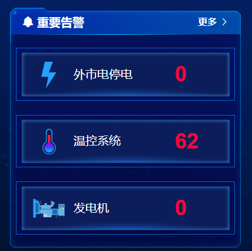

# Frame 边框

### 样例视图



<hr/>

### 编码

```vue
  <asp-frame :title="'能效分析'"
             :showMore="true"
             :icon="'iconnenghao'"
             @handleMore="handleMore()"
             :bodyStyle="{padding: 0}">
             <div>内容</div>
  </asp-frame>
```

<hr/>

### Attributes

参数 | 说明 | 类型 | 可选值 | 默认值
---|---|---|---|---
showMore | 显示更多 | Boolean | true/false | false
body-style | 设置 body 的样式 | object | — | { padding: '20px' }
frame-style | 设置 frame 的样式 | object | — | { padding: '20px' }
size | 边框大小 | string | long / short  | short
title | 标题 | string | —  | —
icon | 字体图表 | string | —  | —

### Frame Events

事件名 | 说明 | 参数 
---|---|---|---|---
handleMore | 当用户手动点击查询触发的事件 | —

### Frame Slot

name | 说明 | 参数 
---|---|---|---|---
left | 左侧 | —
center | 中间 | —
right | 右侧 | —


