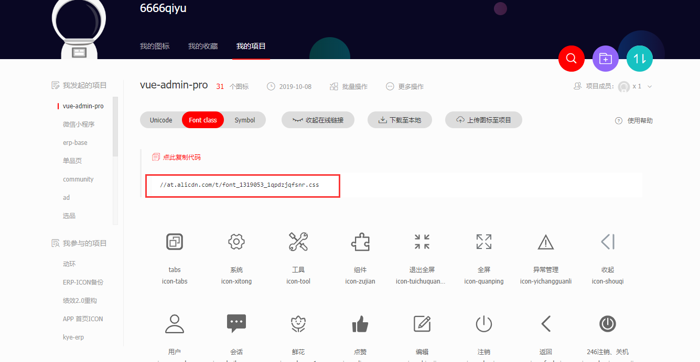

# Iconfont 使用

### 使用

访问项目图标的[iconfont地址](https://www.iconfont.cn/), 然后进入自己的项目复制线上的图标库连接并在项目`index.html`中引入



```
  <link rel="stylesheet" href="//at.alicdn.com/t/font_1319053_1qpdzjqfsnr.css" />
```

或者直接点击下载至本地，然后解压文件。把文件复制到自己的项目中，然后在`main.js`中引用`iconfont.css`文件即可。